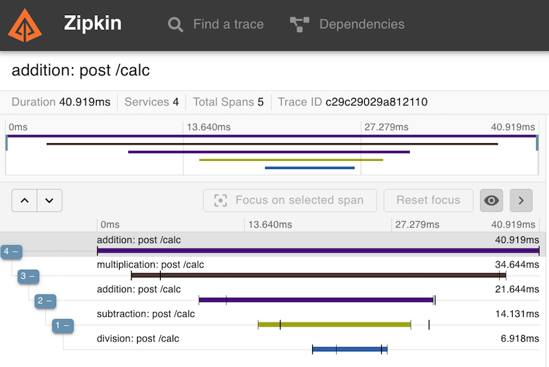

# Distributed Calculator
###### _Necessarily overcomplicating the humble calculator_


Components: Java, Spring Boot, Spring Sleuth, ANTLR4, Maven

# What is this?

A learning tool. A playground. Use this project as a jumping-off point and explore other infrastructure systems.

Takes you beyond the shallow "frontend/backend" examples that come with most infrastructure systems. Makes for a nice demo!


# What can you do with it?

Fire up a basic configuration with Docker Compose and start feeding it arithmetic expressions. Watch the logs to see the expressions get picked apart, passed around, and eventually solved. Scrutinize the calls with Zipkin at `http://localhost:9411`.

Extend the calculator. Break it. Put it back together. 

_Note: `docker-compose.yml` assumes ports `8080-8083` and `9411` are free to use.


## 0. Step 0
There is a snapshot dependency on [antlr4-calculator](https://github.com/arothuis/antlr4-calculator). This means you have to  build, and install that project first before you can build dcalc.

1. Clone the `antlr4-calculator` project. `git clone https://github.com/arothuis/antlr4-calculator.git`
2. Build and install `antlr4-calculator` binaries and sources. `mvn source:jar install`

## 1. Run it

```
% docker compose -p dcalc up
[+] Running 5/0
 ✔ Container dcalc-addition-1        Created
 ✔ Container dcalc-multiplication-1  Created
 ✔ Container dcalc-division-1        Created
 ✔ Container dcalc-subtraction-1     Created
 ✔ Container zipkin                  Created
 ...
```
Barrage of logs...then in a separate terminal window:

```
% docker ps
CONTAINER ID   IMAGE                    COMMAND                 PORTS                              NAMES
035be9a09102   harrybits/dcalc:latest   "java -jar /app.jar"    0.0.0.0:8081->80/tcp               dcalc-subtraction-1
8e72971b87b8   harrybits/dcalc:latest   "java -jar /app.jar"    0.0.0.0:8082->80/tcp               dcalc-multiplication-1
c43f64aac232   harrybits/dcalc:latest   "java -jar /app.jar"    0.0.0.0:8083->80/tcp               dcalc-division-1
7de077012d54   harrybits/dcalc:latest   "java -jar /app.jar"    0.0.0.0:8080->80/tcp               dcalc-addition-1
e2e21611c581   openzipkin/zipkin        "start-zipkin"          9410/tcp, 0.0.0.0:9411->9411/tcp   zipkin

```
The first four containers are all using the same Docker image, but are each configured to handle one of the four basic arithmetic operators: `+,-,*,/`.


## 2. Feed it

The API is just one `POST` endpoint at `/calc`. It does not matter which service receive the initial request; only first trace span will differ, the rest of the tree will look the same.

```
% curl localhost:8080/calc --request POST --header "Content-Type: text/plain" --data "(10-6/3+5)*3"  
39.0%                            
```

Switch to the other terminal and check out the logs. Watch the expression get sliced, diced, then compressed into a single number:

```console
dcalc-addition-1        | ... : Node multiply ((10-6/3+5)*3): left ((10-6/3+5)), right (3)
dcalc-addition-1        | ... : Passing binary op to MULT service: http://multiplication/calc, (10-6/3+5)*3
...
dcalc-division-1        | ... : Node divide (6/3): left (6), right (3)
dcalc-division-1        | ... : Node divide (6/3) --> 2.0
dcalc-subtraction-1     | ... : Node subtract (10-6/3) --> 8.0
dcalc-addition-1        | ... : Node add (10-6/3+5) --> 13.0
dcalc-multiplication-1  | ... : Node multiply ((10-6/3+5)*3) --> 39.0
```

The expression we sent, `(10-6/3+5)*3`, contains all four arithmetic operators `+,-,*,/` and consequently touched every service we just started.

## 3. Trace it

Open a browser and load the Zipkin interface at `http://localhost:9411`.

You don't need to specify any search criteria for the moment. Click `⚙ RUN QUERY` to fetch all traces and click `SHOW` (toward the right side) to open that trace.



The trace shows a visual representation of the system solving the expression. The first action, division, `6/3` is actually at the bottom of the call graph. This makes sense because division has the highest precedence within the parenthesis. Subtraction, addition take place, followed by multiplication.

The structure of the trace matches the last four log messages in reverse.

You can completely control the call graph by changing the input expression.

## 4. Interesting. How does it work?

The input expression is parsed by [ANTLR4](https://www.antlr.org/). The grammar was borrowed from [antlr4-calculator](https://github.com/arothuis/antlr4-calculator). Using a grammar engine is a bit overkill to solve a math equation, but resulting syntax tree and the visitor design pattern were a natural fit for microservice factorization. Of course, the simplest algorithm to solve an equation is the pre/post/infix algorithm that uses a stack.

### Properties

The default values have been chosen to minimize Docker/Kubernetes configuration.

You might start with examining [docker-compose.yml](./docker-compose.yml).

The full list defined in [Properties.java](./src/main/java/com/github/harrybits/dcalc/Properties.java).


### Project Next Steps

- Kubernetes config
- Upgrade to SpringBoot3
- Define some lab exercises
- Istio
    
### Author
harrybits

### Acknowledgments
- [arothuis](https://github.com/arothuis) for the antlr4-calculator demo
- Logo public domain from https://commons.wikimedia.org/w/index.php?curid=2156454